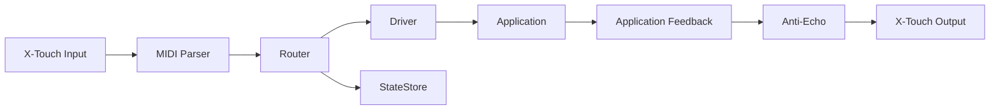

# CLAUDE.md

This file provides guidance to Claude (or any AI assistant) when working with the XTouch GW v3 Rust codebase.

## Project Overview

XTouch GW v3 is a **Rust port** of a TypeScript/Node.js MIDI gateway that bridges a Behringer X-Touch control surface with desktop applications (Voicemeeter, QLC+, OBS Studio). This is a real-time system with strict latency requirements (<20ms end-to-end).

**Current Status**: Active development following an 8-phase migration plan from TypeScript to Rust.

## 🎯 CRITICAL: Reference Implementation

**The TypeScript version in `D:\dev\xtouch-gw-v2\` is the authoritative reference for all behavior and features.**

When implementing any functionality in Rust:
1. **ALWAYS check the TypeScript implementation first** for correct behavior
2. **Run the TS version** to verify expected outputs
3. **Compare MIDI logs** between TS and Rust versions
4. **Match the exact behavior** including timing, message format, and state management

Key reference files in the TypeScript version:
- `src/router.ts` - Core routing logic and anti-echo
- `src/state/` - State management patterns
- `src/xtouch/` - Hardware communication details
- `src/drivers/` - Application integration patterns
- `src/midi/` - MIDI transformations and utilities
- `config.yaml` - Real-world configuration examples

## Essential Context

### What This Project Does
1. **Receives MIDI** from Behringer X-Touch (faders, buttons, encoders)
2. **Routes events** to applications via their APIs (WebSocket, MIDI)
3. **Sends feedback** back to X-Touch (motorized faders, LEDs, LCD)
4. **Manages pages** of control mappings (hot-swappable configurations)
5. **Prevents feedback loops** using time-windowed anti-echo logic

### Critical Performance Constraints
- **Latency**: <20ms end-to-end (MIDI → App → Feedback)
- **Memory**: <50MB RAM usage
- **CPU**: <1% during normal operation
- **Reliability**: Zero panics in production

## Quick Reference

### Build Commands
```bash
cargo build                # Debug build
cargo build --release      # Optimized build
cargo test                 # Run tests
cargo clippy              # Linting
cargo fmt                 # Format code
cargo run -- -c config.yaml  # Run with config
```

### Project Structure
```
src/
├── main.rs        # Entry point, Tokio runtime
├── config.rs      # YAML configuration types
├── router.rs      # Event orchestration
├── state.rs       # MIDI state management
├── xtouch.rs      # Hardware driver
├── midi.rs        # MIDI utilities
├── drivers.rs     # App drivers trait
├── cli.rs         # REPL interface
└── sniffer.rs     # Debug tools
```

## Architecture Principles

### Core Design Patterns
1. **Event-Driven**: Tokio channels for async message passing
2. **Lock-Free Where Possible**: DashMap for concurrent state access
3. **Zero-Copy MIDI**: Avoid allocations in hot path
4. **Shadow State**: Track last-sent values for anti-echo
5. **Atomic Config Swap**: Hot-reload without dropping events

### Data Flow


## Working with This Codebase

### When Making Changes

1. **Performance Critical Paths** (avoid allocations):
   - MIDI message parsing (`midi.rs`)
   - State lookups (`state.rs`)
   - Event routing (`router.rs`)

2. **Concurrency Patterns**:
   - Use `Arc<RwLock<T>>` for shared config
   - Use `Arc<Mutex<T>>` for MIDI ports
   - Prefer channels over shared memory

3. **Error Handling**:
   - Use `anyhow::Result` in application code
   - Use `thiserror` for library errors
   - Never panic on external input
   - Always retry with backoff for connections

### Common Tasks

#### Adding a New Driver
1. Implement the `Driver` trait in `drivers/`
2. Add configuration types in `config.rs`
3. Register in router initialization
4. Add tests with mock MIDI

#### Modifying MIDI Routing
1. Update state types in `state.rs`
2. Adjust anti-echo windows if needed
3. Test with real hardware
4. Verify no feedback loops

#### Debugging Latency Issues
1. Use `tracing` spans to measure stages
2. Check for blocking operations
3. Profile with `cargo flamegraph`
4. Verify channel buffer sizes

## Key Implementation Details

### MIDI Specifics
- **14-bit values**: Faders use PitchBend (0-16383)
- **7-bit values**: Buttons/encoders use CC/Note (0-127)
- **Channel semantics**: In MCU mode, channel = physical strip
- **Anti-echo windows**: PB=250ms, CC=100ms, Note=10ms

### Windows MIDI Quirks
- Port names include suffixes like "MIDIIN2"
- Exclusive access - only one open per port
- Recovery needs 250ms+ after disconnect
- Use substring matching for port discovery

### State Management Rules
1. **Source of truth**: App feedback updates state
2. **Optimistic updates**: Update immediately on send
3. **Page changes**: Full state replay required
4. **Conflict resolution**: Last-Write-Wins within time window

## Testing Guidelines

### Unit Tests
- Mock MIDI ports with `mockall`
- Use `tokio::test` for async tests
- Test anti-echo windows with `tokio::time::pause()`

### Integration Tests
- Requires real X-Touch hardware
- Use golden MIDI logs for regression
- Profile latency with oscilloscope if available

### Manual Testing Checklist
- [ ] Page switching via F1-F8
- [ ] Fader motor feedback
- [ ] LED indicators
- [ ] LCD text/colors
- [ ] Config hot-reload
- [ ] Reconnection after disconnect

## Common Pitfalls

### From TypeScript Port
1. **Channel confusion**: Fader channel ≠ target CC channel
2. **Double port opening**: Check passthrough before control MIDI
3. **Missing feedback**: Drivers must emit or faders won't sync
4. **LCD restoration**: Only bottom line, top unchanged

### Rust-Specific
1. **Blocking runtime**: Use `spawn_blocking` for CPU work
2. **Large futures**: Box recursive async functions
3. **Channel deadlock**: Always use bounded channels
4. **Panic in tasks**: Wrap spawns with error handling

## Performance Optimization Tips

1. **Preallocate**: Use `with_capacity` for collections
2. **Batch events**: Coalesce within 16ms windows
3. **Avoid cloning**: Use `Arc` for shared data
4. **Profile first**: Don't optimize without measurements

## Questions to Ask When Stuck

1. Is this in the hot path? (If yes, avoid allocations)
2. Can this block? (If yes, use async or spawn_blocking)
3. Is this shared state? (Prefer channels to locks)
4. Can this panic? (Add proper error handling)
5. Is this tested? (Add tests before refactoring)

## Reference Documents

### Primary References (This Project)
- **[RUST_MIGRATION_SPEC.md](RUST_MIGRATION_SPEC.md)**: Complete migration plan
- **[TASKS.md](TASKS.md)**: Current development status
- **[MEMORY.md](MEMORY.md)**: Lessons learned and gotchas

### TypeScript Reference Implementation
- **Source Code**: `D:\dev\xtouch-gw-v2\src\` - THE source of truth for behavior
- **Configuration**: `D:\dev\xtouch-gw-v2\config.yaml` - Working config example
- **Documentation**: `D:\dev\xtouch-gw-v2\docs\` - Architecture and flow diagrams
- **Tests**: `D:\dev\xtouch-gw-v2\src\**\_tests\` - Expected behavior tests

### How to Use the TS Reference
1. **For any feature**: First read the corresponding TS file
2. **For behavior questions**: Run the TS version and observe
3. **For MIDI formats**: Use TS sniffer (`pnpm sniff:web` in v2 folder)
4. **For state management**: Study `src/state/` patterns
5. **For timing/delays**: Check anti-echo windows in `src/router/antiEcho.ts`

## Interaction Tips for AI Assistants

1. **Be concrete**: Reference specific files and line numbers
2. **Check performance**: Consider latency impact of changes
3. **Test assumptions**: Verify MIDI behavior with real hardware
4. **Follow phases**: Respect the migration plan order
5. **Document TODOs**: Mark unknowns clearly in code

## Current Focus

Check [TASKS.md](TASKS.md) for the current development phase. As of project initialization, we're in **Phase 1: Core Runtime Foundation**.

Priority areas needing attention:
- [ ] Config loading and validation
- [ ] Logging infrastructure setup
- [ ] Basic CLI skeleton
- [ ] Error handling strategy
