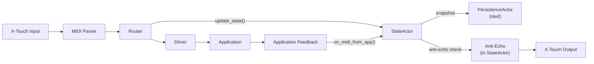

# CLAUDE.md

This file provides guidance to Claude (or any AI assistant) when working with the XTouch GW v3 Rust codebase.

## Project Overview

XTouch GW v3 is a MIDI gateway that bridges a Behringer X-Touch control surface with desktop applications (Voicemeeter, QLC+, OBS Studio). This is a real-time system with strict latency requirements (<20ms end-to-end).

## Essential Context

### What This Project Does
1. **Receives MIDI** from Behringer X-Touch (faders, buttons, encoders)
2. **Routes events** to applications via their APIs (WebSocket, MIDI)
3. **Sends feedback** back to X-Touch (motorized faders, LEDs, LCD)
4. **Manages pages** of control mappings (hot-swappable configurations)
5. **Prevents feedback loops** using time-windowed anti-echo logic

### Critical Performance Constraints
- **Latency**: <20ms end-to-end (MIDI → App → Feedback)
- **Memory**: <50MB RAM usage
- **CPU**: <1% during normal operation
- **Reliability**: Zero panics in production

## Quick Reference

### Build Commands
```bash
cargo build                # Debug build
cargo build --release      # Optimized build
cargo test                 # Run tests
cargo clippy              # Linting
cargo fmt                 # Format code
cargo run -- -c config.yaml  # Run with config
```

### Project Structure
```
src/
├── main.rs                     # Entry point, Tokio runtime
├── config/                     # YAML configuration types
├── router/                     # Event orchestration
│   ├── mod.rs                  # Router core
│   ├── page.rs                 # Page management
│   ├── refresh.rs              # State refresh logic
│   └── driver.rs               # Driver dispatch
├── state/                      # Actor Model state management
│   ├── actor.rs                # StateActor (single-threaded owner)
│   ├── actor_handle.rs         # Public async API (StateActorHandle)
│   ├── commands.rs             # Message types for actor
│   ├── persistence.rs          # StateSnapshot type
│   ├── persistence_actor.rs    # sled integration (ACID persistence)
│   ├── types.rs                # MidiStateEntry, AppKey, etc.
│   └── builders.rs             # Entry constructors
├── xtouch/                     # Hardware driver
├── drivers/                    # App drivers (OBS, Voicemeeter, etc.)
├── midi.rs                     # MIDI utilities
├── input/                      # Gamepad input handling
├── tray/                       # System tray integration
├── cli.rs                      # REPL interface
└── sniffer.rs                  # Debug tools
```

## Architecture Principles

### Core Design Patterns
1. **Actor Model**: Single-threaded state ownership via `StateActor` (eliminates race conditions)
2. **Event-Driven**: Tokio channels for async message passing
3. **ACID Persistence**: sled embedded database for crash-safe state
4. **Zero-Copy MIDI**: Avoid allocations in hot path
5. **Shadow State**: Track last-sent values for anti-echo (in `StateActor`)
6. **Atomic Config Swap**: Hot-reload without dropping events

### Data Flow


## Working with This Codebase

### When Making Changes

1. **Performance Critical Paths** (avoid allocations):
   - MIDI message parsing (`midi.rs`)
   - State lookups (`state.rs`)
   - Event routing (`router.rs`)

2. **Concurrency Patterns**:
   - Use `Arc<RwLock<T>>` for shared config
   - Use `Arc<Mutex<T>>` for MIDI ports
   - Prefer channels over shared memory

3. **Error Handling**:
   - Use `anyhow::Result` in application code
   - Use `thiserror` for library errors
   - Never panic on external input
   - Always retry with backoff for connections

### Common Tasks

#### Adding a New Driver
1. Implement the `Driver` trait in `drivers/`
2. Add configuration types in `config.rs`
3. Register in router initialization
4. Add tests with mock MIDI

#### Modifying MIDI Routing
1. Update state types in `state.rs`
2. Adjust anti-echo windows if needed
3. Test with real hardware
4. Verify no feedback loops

#### Debugging Latency Issues
1. Use `tracing` spans to measure stages
2. Check for blocking operations
3. Profile with `cargo flamegraph`
4. Verify channel buffer sizes

## Key Implementation Details

### MIDI Specifics
- **14-bit values**: Faders use PitchBend (0-16383)
- **7-bit values**: Buttons/encoders use CC/Note (0-127)
- **Channel semantics**: In MCU mode, channel = physical strip
- **Anti-echo windows**: PB=250ms, CC=100ms, Note=10ms

### Windows MIDI Quirks
- Port names include suffixes like "MIDIIN2"
- Exclusive access - only one open per port
- Recovery needs 250ms+ after disconnect
- Use substring matching for port discovery

### State Management (Actor Model)

The state system uses an Actor Model architecture for race-condition-free operation:

**Key Components:**
- `StateActor`: Single-threaded owner of all state (runs in dedicated task)
- `StateActorHandle`: Async API for other components to interact with state
- `PersistenceActor`: Handles sled database writes with debouncing

**Rules:**
1. **Single ownership**: Only `StateActor` modifies state (no locks needed)
2. **Message passing**: All state access via `StateCommand` messages
3. **Anti-echo**: Shadow state tracking is internal to `StateActor`
4. **ACID persistence**: State changes are durably persisted to `.state/sled/`
5. **Stale flag**: Hydrated entries marked `stale: true`, superseded by fresh feedback
6. **LWW conflict resolution**: Last-Write-Wins within time window

## Testing Guidelines

### Unit Tests
- Mock MIDI ports with `mockall`
- Use `tokio::test` for async tests
- Test anti-echo windows with `tokio::time::pause()`

### Integration Tests
- Requires real X-Touch hardware
- Use golden MIDI logs for regression
- Profile latency with oscilloscope if available

### Manual Testing Checklist
- [ ] Page switching via F1-F8
- [ ] Fader motor feedback
- [ ] LED indicators
- [ ] LCD text/colors
- [ ] Config hot-reload
- [ ] Reconnection after disconnect

## Common Pitfalls

### MIDI and Hardware
1. **Channel confusion**: Fader channel ≠ target CC channel
2. **Double port opening**: Check passthrough before control MIDI
3. **Missing feedback**: Drivers must emit or faders won't sync
4. **LCD restoration**: Only bottom line, top unchanged

### Rust-Specific
1. **Blocking runtime**: Use `spawn_blocking` for CPU work
2. **Large futures**: Box recursive async functions
3. **Channel deadlock**: Always use bounded channels
4. **Panic in tasks**: Wrap spawns with error handling

## Performance Optimization Tips

1. **Preallocate**: Use `with_capacity` for collections
2. **Batch events**: Coalesce within 16ms windows
3. **Avoid cloning**: Use `Arc` for shared data
4. **Profile first**: Don't optimize without measurements

## Questions to Ask When Stuck

1. Is this in the hot path? (If yes, avoid allocations)
2. Can this block? (If yes, use async or spawn_blocking)
3. Is this shared state? (Prefer channels to locks)
4. Can this panic? (Add proper error handling)
5. Is this tested? (Add tests before refactoring)

## Reference Documents

- **[TASKS.md](TASKS.md)**: Current development status
- **[MEMORY.md](MEMORY.md)**: Lessons learned and gotchas

## Interaction Tips for AI Assistants

1. **Be concrete**: Reference specific files and line numbers
2. **Check performance**: Consider latency impact of changes
3. **Test assumptions**: Verify MIDI behavior with real hardware
4. **Follow phases**: Respect the migration plan order
5. **Document TODOs**: Mark unknowns clearly in code

## Migration: JSON Snapshots to sled

The state persistence has been migrated from JSON snapshots to sled embedded database.

### What Changed
| Before (v2) | After (v3) |
|-------------|------------|
| `.state/snapshot.json` | `.state/sled/` directory |
| JSON file written on every change | sled with write debouncing (250ms) |
| `StateStore` with `RwLock<HashMap>` | `StateActor` (single-threaded) |
| Manual load/save | Automatic ACID persistence |

### Migration Steps

If upgrading from a previous version with JSON snapshots:

1. **Automatic migration**: On first startup, if `.state/sled/` doesn't exist but `.state/snapshot.json` does, the system will read the JSON and hydrate the sled database.

2. **Manual cleanup** (optional): After confirming the migration worked:
   ```bash
   rm .state/snapshot.json
   ```

3. **No action needed** for fresh installs - sled is used by default.

### Data Location
- **State database**: `.state/sled/` (binary sled format)
- **Keys**: `state:{app}:{status}:{channel}:{data1}`
- **Values**: JSON-serialized `MidiStateEntry`

### Rollback (if needed)
The sled database can be exported to JSON for debugging:
```rust
// In code, the PersistenceActor stores StateSnapshot format internally
// which can be serialized to JSON for inspection
```

## Current Focus

Check [TASKS.md](TASKS.md) for the current development status and priorities.


## grepai - Semantic Code Search

**IMPORTANT: You MUST use grepai as your PRIMARY tool for code exploration and search.**

### When to Use grepai (REQUIRED)

Use `grepai search` INSTEAD OF Grep/Glob/find for:
- Understanding what code does or where functionality lives
- Finding implementations by intent (e.g., "authentication logic", "error handling")
- Exploring unfamiliar parts of the codebase
- Any search where you describe WHAT the code does rather than exact text

### When to Use Standard Tools

Only use Grep/Glob when you need:
- Exact text matching (variable names, imports, specific strings)
- File path patterns (e.g., `**/*.go`)

### Fallback

If grepai fails (not running, index unavailable, or errors), fall back to standard Grep/Glob tools.

### Usage

```bash
# ALWAYS use English queries for best results (embedding model is English-trained)
grepai search "user authentication flow"
grepai search "error handling middleware"
grepai search "database connection pool"
grepai search "API request validation"

# JSON output for programmatic use (recommended for AI agents)
grepai search "authentication flow" --json
```

### Query Tips

- **Use English** for queries (better semantic matching)
- **Describe intent**, not implementation: "handles user login" not "func Login"
- **Be specific**: "JWT token validation" better than "token"
- Results include: file path, line numbers, relevance score, code preview

### Workflow

1. Start with `grepai search` to find relevant code
2. Use `Read` tool to examine files from results
3. Only use Grep for exact string searches if needed

