# XTouch GW

Node.js/TypeScript gateway to control Voicemeeter, QLC+ and OBS from a Behringer X‑Touch (MIDI DIN).

### Why a gateway?
- Unify multiple applications under a single control surface (X‑Touch), without reconfiguring each app.
- Benefit from reliable bidirectional sync (motorized faders, LEDs, LCD) with snapshot on boot and on each page change.
- Structure usage by "pages" to instantly switch between profiles (audio, lights, video control).
- Route and transform MIDI as needed (bridges/passthroughs, PitchBend → CC/Note for QLC+ compatibility).
- Deploy a simple YAML config with hot‑reload and debug tools (CLI + sniffer).

The app handles notably:

- Page system: define multiple mapping pages and switch from one to another from the X‑Touch. By default, two MIDI notes (46=previous, 47=next) on a configurable channel trigger page change.
- MIDI bridges per page (passthroughs) and global Voicemeeter bridge
- Feedback to the surface (motorized faders, LCD, LEDs) and LCD labels
- Development CLI (learn/sniffer/fader/lcd) and Web MIDI Sniffer

### Architecture Overview (Mermaid)

```mermaid
flowchart LR
  XT["🎛 X‑Touch"] --> XTD["XTouchDriver"]
  XTD --> R["Router (pages)"]
  R --> VMDr["VoicemeeterDriver"]
  R --> QLCDr["QLCDriver"]
  R --> OBSDr["OBSDriver"]
  VMDr --> VM["Voicemeeter"]
  QLCDr --> QLC["QLC+"]
  OBSDr --> OBS["OBS"]
  VM --> VMDr
  QLC --> QLCDr
  OBS --> OBSDr
  C["Config (YAML, hot‑reload)"] --> R
  C --> VMDr
  C --> QLCDr
  C --> OBSDr
  VMDr --> XTD
  QLCDr --> XTD
  OBSDr --> XTD
```



Detailed diagrams in [`docs/specifications.md`](docs/specifications.md).

## Prerequisites
- Node.js >= 24.1
- pnpm (via Corepack)

## Installation
```sh
corepack enable
pnpm install
```

## Getting Started
```sh
pnpm dev         # launch in development mode (tsx watch)
pnpm build       # transpile TypeScript → dist/
pnpm start       # execute dist/index.js
pnpm test        # unit tests (Vitest) + coverage
pnpm test:watch  # tests in watch mode
```

To enable detailed logs (PowerShell):
```powershell
$env:LOG_LEVEL="debug"; pnpm dev
```

## Configuration (config.yaml)

File read at startup, with hot‑reload. Realistic example aligned with current code:

```yaml
midi:
  input_port: "UM-One"
  output_port: "UM-One"

paging:
  channel: 1      # NoteOn channel for navigation
  prev_note: 46   # previous page
  next_note: 47   # next page

pages:
  - name: "Voicemeeter+QLC"
    lcd:
      labels:     # 8 scribble strips (0..7). Supports "\n" for 2 lines.
        - "Mic\nBaba"
        - "Mic\nMath"
        - "Mic\nJu"
        - "Son\nMac"
        - "Son\nPC"
        - "Son\nMASTER"
        - "Son\nRetours"
        - "Lum\nFace"
    passthroughs:
      - driver: "midi"
        to_port: "xtouch-gw"
        from_port: "xtouch-gw-feedback"
        filter:
          channels: [1,2,3,4,5,6,7]
          types: ["noteOn","noteOff","controlChange","pitchBend"]
          includeNotes: [0,8,16,24]
      - driver: "midi"
        to_port: "qlc-in"
        from_port: "qlc-out"
        filter:
          channels: [8,9]
          types: ["noteOn","noteOff","controlChange","pitchBend"]
        transform:
          pb_to_cc:
            target_channel: 1
            base_cc: "0x45"   # ch1→0x46, ch2→0x47, …
    controls: {}              # mappings (router) – optional at this stage

    # Example of direct global MIDI mapping (without going through a bridge):
    # Automatically converts PB→CC if the fader emits PitchBend.
    # Here: fader1 → CC81 ch1 on QLC port (qlc-in)
    controls:
      fader1:
        app: "qlc"
        midi:
          type: "cc"
          channel: 1
          cc: 81

  - name: "Default"
    controls: {}
```

Behavior:
- If at least one page defines `passthrough`/`passthroughs`, per-page passthrough mode is active. On each page change, the page's bridges are (re)opened.
- Otherwise, a global X‑Touch ⇄ Voicemeeter bridge is automatically enabled (`xtouch-gw`/`xtouch-gw-feedback`).
 

## Pages, LCD and Navigation
- Navigate between pages via NoteOn on `paging.channel` (default ch=1) with `prev_note` (46) and `next_note` (47).
- LCD labels per page via `pages[].lcd.labels`:
  - either a string with line break `upper\nlower`
  - or an object `{ upper, lower }`
- If no label is provided, the page name is displayed at the top of strip 0.

## Development CLI
The CLI launches with the application and offers:
- `pages`, `page <idx|name>`
- `emit <controlId> [value]`
- `midi-ports`, `midi-open <idx|name>`, `midi-close`
- `learn <id>` (suggests a `controlId` and a YAML line)
- `fader <ch> <0..16383>` (motor)
- `lcd <strip0-7> <upper> [lower]`

Details and port conflict prevention workflow in `docs/CLI.md`.

## Web MIDI Sniffer (browser)
```sh
pnpm sniff:web
```
Then open `http://localhost:8123/` to see MIDI messages in hex with Δ time.

## Logging
- Variable `LOG_LEVEL`: `error | warn | info | debug | trace`.
- Example (PowerShell):
  ```powershell
  $env:LOG_LEVEL="debug"; pnpm dev
  ```

## Quick Troubleshooting
- After logic changes, restart the process (or rebuild) to avoid old behavior loaded in memory.
- In case of MIDI loop (loopMIDI in safety mode), cut one of the bridges, check the filters, then restart the ports.
- Verify port names `midi.input_port` / `midi.output_port` and bridge ports.

## License
MPL-2.0 (Mozilla Public License 2.0)