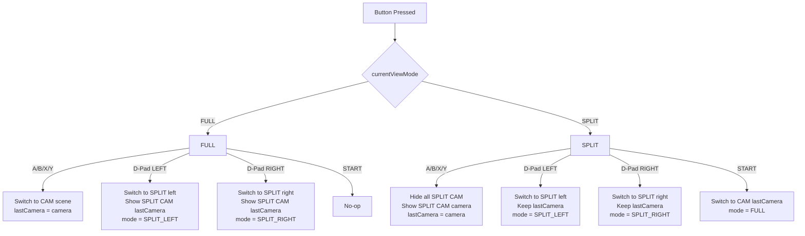

## Spécification – Contrôle OBS : changement de caméras & vues split via manette

### Objectif

Piloter **OBS Studio** via manettes de jeu (multi-gamepad avec état partagé), en utilisant des commandes **WebSocket**, pour :

* changer de caméra en **vue pleine**
* activer des **vues split** (écran partagé gauche/droite)
* sélectionner dynamiquement **quelle caméra est visible dans le split**

---

## Architecture : Multi-gamepad avec état partagé

### Modèle d'état global

L'état est **partagé entre toutes les manettes** :

* `currentViewMode: FULL | SPLIT_LEFT | SPLIT_RIGHT`
* `lastCamera: String` (ID de caméra : "Main", "Main2", "Jardin", "Cour")

**Implication** : Si gamepad1 active SPLIT_LEFT et sélectionne "Jardin", puis gamepad2 appuie sur A (Main), les deux manettes voient la transition vers "Main" dans le split gauche.

### Pourquoi un état partagé ?

- Permet à plusieurs opérateurs de collaborer sur le même système
- Évite les conflits d'état entre manettes
- Simplifie la logique (un seul état à maintenir)

---

## Scènes OBS requises

### 1. Vues pleines (scènes OBS)

* `--- CAM Main`
* `--- CAM Main 2`
* `--- CAM Jardin`
* `--- CAM Cour`

👉 Une scène = une caméra plein écran

---

### 2. Vues split (scènes OBS)

* `--- SPLIT left`
* `--- SPLIT right`

👉 Ces scènes sont **structurelles** (layout fixe, positionnement gauche/droite).

---

## Sources caméra dans les scènes split

Dans **chaque scène split** (`--- SPLIT left` et `--- SPLIT right`), créer **4 sources caméra** :

* `SPLIT CAM Main`
* `SPLIT CAM Main 2`
* `SPLIT CAM Jardin`
* `SPLIT CAM Cour`

### Règle impérative

➡️ **Une seule source `SPLIT CAM *` visible à la fois**  
Les 3 autres doivent être **désactivées (hidden)**.

**Structure OBS à créer manuellement :**

```
OBS Studio
├── Scènes caméra (plein écran)
│   ├── --- CAM Main
│   ├── --- CAM Main 2
│   ├── --- CAM Jardin
│   └── --- CAM Cour
│
├── Scènes split
│   ├── --- SPLIT left
│   │   └── Sources (UNE SEULE visible à la fois)
│   │       ├── SPLIT CAM Main
│   │       ├── SPLIT CAM Main 2
│   │       ├── SPLIT CAM Jardin
│   │       └── SPLIT CAM Cour
│   │
│   └── --- SPLIT right
│       └── Sources (UNE SEULE visible à la fois)
│           ├── SPLIT CAM Main
│           ├── SPLIT CAM Main 2
│           ├── SPLIT CAM Jardin
│           └── SPLIT CAM Cour
```

**Note** : Le contenu non-caméra (vidéo, image, screen share…) est hors scope de cette spec.

---

## Mapping des boutons (toutes manettes)

### Boutons caméra

* **A** → Caméra `Main`
* **B** → Caméra `Main 2`
* **X** → Caméra `Jardin`
* **Y** → Caméra `Cour`

### Gestion des vues split

* **D-Pad LEFT** → Activer `--- SPLIT left`
* **D-Pad RIGHT** → Activer `--- SPLIT right`
* **START** → Retour à la vue caméra pleine

---

## Configuration YAML

### Ajout dans `obs:` section

```yaml
obs:
  host: "127.0.0.1"
  port: 4455
  password: "aaaaaa"
  
  # NOUVEAU : Configuration du contrôle caméra
  camera_control:
    cameras:
      - id: "Main"
        scene: "--- CAM Main"
        split_source: "SPLIT CAM Main"
      - id: "Main2"
        scene: "--- CAM Main 2"
        split_source: "SPLIT CAM Main 2"
      - id: "Jardin"
        scene: "--- CAM Jardin"
        split_source: "SPLIT CAM Jardin"
      - id: "Cour"
        scene: "--- CAM Cour"
        split_source: "SPLIT CAM Cour"
    splits:
      left: "--- SPLIT left"
      right: "--- SPLIT right"
```

### Mappings dans `pages_global:`

```yaml
pages_global:
  controls:
    # Boutons caméra - gamepad1
    gamepad1.btn.a:
      app: "obs"
      action: "selectCamera"
      params: ["Main"]
    gamepad1.btn.b:
      app: "obs"
      action: "selectCamera"
      params: ["Main2"]
    gamepad1.btn.x:
      app: "obs"
      action: "selectCamera"
      params: ["Jardin"]
    gamepad1.btn.y:
      app: "obs"
      action: "selectCamera"
      params: ["Cour"]
    
    # D-Pad split - gamepad1
    gamepad1.btn.dpad_left:
      app: "obs"
      action: "enterSplit"
      params: ["left"]
    gamepad1.btn.dpad_right:
      app: "obs"
      action: "enterSplit"
      params: ["right"]
    
    # Retour vue pleine - gamepad1
    gamepad1.btn.start:
      app: "obs"
      action: "exitSplit"
      params: []
    
    # Dupliquer pour gamepad2 (mêmes actions, état partagé)
    gamepad2.btn.a:
      app: "obs"
      action: "selectCamera"
      params: ["Main"]
    gamepad2.btn.b:
      app: "obs"
      action: "selectCamera"
      params: ["Main2"]
    gamepad2.btn.x:
      app: "obs"
      action: "selectCamera"
      params: ["Jardin"]
    gamepad2.btn.y:
      app: "obs"
      action: "selectCamera"
      params: ["Cour"]
    gamepad2.btn.dpad_left:
      app: "obs"
      action: "enterSplit"
      params: ["left"]
    gamepad2.btn.dpad_right:
      app: "obs"
      action: "enterSplit"
      params: ["right"]
    gamepad2.btn.start:
      app: "obs"
      action: "exitSplit"
      params: []
```

---

## Actions du driver OBS

### 1. `selectCamera` (hybride)

**Paramètres** : `camera_id: String`

**Comportement** :

* Si `currentViewMode = FULL` :
  * Switch OBS vers `--- CAM [camera_id]`
  * `lastCamera = camera_id`
* Si `currentViewMode = SPLIT_LEFT | SPLIT_RIGHT` :
  * Ne change **pas** de scène OBS
  * Dans la scène split active :
    * Hide all `SPLIT CAM *`
    * Show `SPLIT CAM [camera_id]`
  * `lastCamera = camera_id`

### 2. `enterSplit`

**Paramètres** : `side: String` ("left" | "right")

**Comportement** :

* Switch OBS vers `--- SPLIT [side]`
* Dans la scène split :
  * Hide all `SPLIT CAM *`
  * Show `SPLIT CAM [lastCamera]`
* Mettre à jour : `currentViewMode = SPLIT_LEFT | SPLIT_RIGHT`

### 3. `exitSplit`

**Paramètres** : aucun

**Comportement** :

* Switch OBS vers `--- CAM [lastCamera]`
* Mettre à jour : `currentViewMode = FULL`

### 4. `setSceneItemEnabled` (utilitaire interne)

**Paramètres** : `scene: String, source: String, enabled: bool`

**Comportement** :

* Appelle l'API OBS WebSocket `SetSceneItemEnabled`
* Masque ou affiche une source dans une scène

---

## Règles de comportement

### Mode vue pleine (`currentViewMode = FULL`)

| Bouton | Action |
|--------|--------|
| A/B/X/Y | Switch vers `--- CAM [camera]`<br/>`lastCamera = [camera]` |
| D-Pad LEFT | Switch vers `--- SPLIT left`<br/>Show `SPLIT CAM [lastCamera]`<br/>`currentViewMode = SPLIT_LEFT` |
| D-Pad RIGHT | Switch vers `--- SPLIT right`<br/>Show `SPLIT CAM [lastCamera]`<br/>`currentViewMode = SPLIT_RIGHT` |
| START | No-op (déjà en vue pleine) |

### Mode vue split (`SPLIT_LEFT` ou `SPLIT_RIGHT`)

| Bouton | Action |
|--------|--------|
| A/B/X/Y | Hide all `SPLIT CAM *`<br/>Show `SPLIT CAM [camera]`<br/>`lastCamera = [camera]` |
| D-Pad LEFT | Switch vers `--- SPLIT left`<br/>Keep `lastCamera` |
| D-Pad RIGHT | Switch vers `--- SPLIT right`<br/>Keep `lastCamera` |
| START | Switch vers `--- CAM [lastCamera]`<br/>`currentViewMode = FULL` |

---

## Invariants OBS (critiques)

* ❌ Ne **jamais** afficher plus d'une source `SPLIT CAM *` dans une scène split
* ✅ La scène split ne définit **pas** la caméra : c'est `lastCamera` qui décide
* ✅ Les boutons A/B/X/Y ont **toujours la même signification** (sélection caméra)
* ✅ OBS est **stateless** : toute la logique (mode, lastCamera) est dans le driver
* ✅ Les commandes WebSocket doivent être **idempotentes** (safe à répéter)

---

## Arbre de décision



---

## Implémentation dans le code

### Types Rust (dans `src/config/mod.rs`)

```rust
#[derive(Debug, Clone, Deserialize, Serialize)]
pub struct CameraControlConfig {
    pub cameras: Vec<CameraConfig>,
    pub splits: SplitConfig,
}

#[derive(Debug, Clone, Deserialize, Serialize)]
pub struct CameraConfig {
    pub id: String,
    pub scene: String,
    pub split_source: String,
}

#[derive(Debug, Clone, Deserialize, Serialize)]
pub struct SplitConfig {
    pub left: String,
    pub right: String,
}

// Ajouter à ObsConfig :
pub struct ObsConfig {
    // ... champs existants
    pub camera_control: Option<CameraControlConfig>,
}
```

### État interne (dans `src/drivers/obs.rs`)

```rust
#[derive(Debug, Clone, PartialEq)]
enum ViewMode {
    Full,
    SplitLeft,
    SplitRight,
}

struct CameraControlState {
    current_view_mode: ViewMode,
    last_camera: String,
}
```

### Méthodes du driver

* `select_camera(camera_id: String)` : Logique hybride (FULL vs SPLIT)
* `enter_split(side: String)` : Active split + source
* `exit_split()` : Retour FULL
* `set_scene_item_enabled(scene: String, source: String, enabled: bool)` : API OBS

---

## Notes d'implémentation

### Centraliser `setSplitCamera(camera_id)`

```rust
async fn set_split_camera(&self, scene_name: &str, camera_id: &str) -> Result<()> {
    // 1. Hide all SPLIT CAM sources
    for camera_config in &self.camera_configs {
        self.set_scene_item_enabled(
            scene_name,
            &camera_config.split_source,
            false
        ).await?;
    }
    
    // 2. Show SPLIT CAM [camera_id]
    let target_config = find_camera_config(camera_id)?;
    self.set_scene_item_enabled(
        scene_name,
        &target_config.split_source,
        true
    ).await?;
    
    Ok(())
}
```

### Idempotence

Les appels répétés doivent être sûrs :

* `setScene("--- SPLIT left")` → OK même si déjà sur cette scène
* `setSceneItemEnabled(scene, source, true)` → OK même si déjà visible

---

## Cas d'usage typiques

### Scénario 1 : Passage de plein écran à split

1. État initial : `FULL`, caméra "Main"
2. Utilisateur appuie sur **D-Pad LEFT**
3. Résultat :
   * OBS switch vers `--- SPLIT left`
   * Source `SPLIT CAM Main` visible, autres cachées
   * État : `SPLIT_LEFT`, caméra "Main"

### Scénario 2 : Changement de caméra en split

1. État : `SPLIT_LEFT`, caméra "Main"
2. Utilisateur appuie sur **X** (Jardin)
3. Résultat :
   * OBS reste sur `--- SPLIT left`
   * Hide `SPLIT CAM Main`, show `SPLIT CAM Jardin`
   * État : `SPLIT_LEFT`, caméra "Jardin"

### Scénario 3 : Retour au plein écran

1. État : `SPLIT_RIGHT`, caméra "Cour"
2. Utilisateur appuie sur **START**
3. Résultat :
   * OBS switch vers `--- CAM Cour`
   * État : `FULL`, caméra "Cour"

### Scénario 4 : Multi-gamepad collaboratif

1. État : `FULL`, caméra "Main"
2. **Gamepad1** appuie sur **D-Pad LEFT** → `SPLIT_LEFT`, "Main"
3. **Gamepad2** appuie sur **Y** (Cour) → `SPLIT_LEFT`, "Cour"
4. **Gamepad1** appuie sur **START** → `FULL`, "Cour"

---

## Tests de validation

### Checklist avant déploiement

- [ ] Les 4 scènes CAM existent dans OBS
- [ ] Les 2 scènes SPLIT existent dans OBS
- [ ] Chaque scène SPLIT contient les 4 sources SPLIT CAM
- [ ] La config YAML `camera_control` est complète
- [ ] Les mappings `gamepad*.btn.*` sont définis
- [ ] Toutes les manettes contrôlent le même état

### Tests fonctionnels

1. **Changement de caméra en FULL** : A/B/X/Y changent de scène
2. **Entrée en split** : D-Pad LEFT/RIGHT activent les splits
3. **Changement de caméra en split** : A/B/X/Y changent la source visible
4. **Retour au plein écran** : START revient à la caméra active
5. **Multi-gamepad** : Les deux manettes voient les mêmes changements

---

## Résumé des impacts

| Fichier | Modifications |
|---------|---------------|
| `docs/spec-split-obs.md` | ✅ Aligné avec l'architecture existante |
| `src/config/mod.rs` | ➕ Types `CameraControlConfig`, `CameraConfig`, `SplitConfig` |
| `src/drivers/obs.rs` | ➕ État `CameraControlState`, `ViewMode`<br/>➕ Actions `selectCamera`, `enterSplit`, `exitSplit` |
| `config.example.yaml` | ➕ Section `obs.camera_control`<br/>➕ Mappings D-Pad dans `pages_global` |

---

## Compatibilité et migration

### Rétrocompatibilité

* Les actions OBS existantes (`changeScene`, `nudgeX/Y`, etc.) restent inchangées
* La config `obs:` existante (host/port/password) reste valide
* Le `camera_control` est **optionnel** (backward compatible)

### Migration progressive

1. Ajouter `camera_control` dans la config
2. Créer les scènes split dans OBS
3. Ajouter les mappings D-Pad
4. Tester avec une seule manette
5. Étendre à plusieurs manettes
